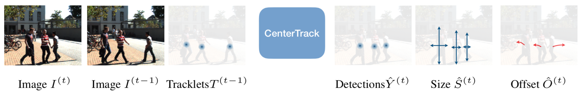
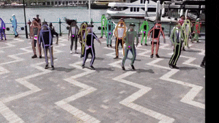

# Tracking Objects as Points
Simultaneous object detection and tracking using center points:

> [**Tracking Objects as Points**](http://arxiv.org/abs/2004.01177),            
> Xingyi Zhou, Vladlen Koltun, Philipp Kr&auml;henb&uuml;hl,        
> *arXiv technical report ([arXiv 2004.01177](http://arxiv.org/abs/2004.01177))*  

    @article{zhou2020tracking,
      title={Tracking Objects as Points},
      author={Zhou, Xingyi and Koltun, Vladlen and Kr{\"a}henb{\"u}hl, Philipp},
      journal={ECCV},
      year={2020}
    }

Contact: [zhouxy@cs.utexas.edu](mailto:zhouxy@cs.utexas.edu). Any questions or discussion are welcome! 

## Abstract
Tracking has traditionally been the art of following interest points through space and time. This changed with the rise of powerful deep networks. Nowadays, tracking is dominated by pipelines that perform object detection followed by temporal association, also known as tracking-by-detection. In this paper, we present a simultaneous detection and tracking algorithm that is simpler, faster, and more accurate than the state of the art. Our tracker, CenterTrack, applies a detection model to a pair of images and detections from the prior frame. Given this minimal input, CenterTrack localizes objects and predicts their associations with the previous frame. That's it. CenterTrack is simple, online (no peeking into the future), and real-time. It achieves 67.3% MOTA on the MOT17 challenge at 22 FPS and 89.4% MOTA on the KITTI tracking benchmark at 15 FPS, setting a new state of the art on both datasets. CenterTrack is easily extended to monocular 3D tracking by regressing additional 3D attributes. Using monocular video input, it achieves 28.3% AMOTA@0.2 on the newly released nuScenes 3D tracking benchmark, substantially outperforming the monocular baseline on this benchmark while running at 28 FPS.

## Features at a glance

- One-sentence method summary: Our model takes the current frame, the previous frame, and a heatmap rendered from previous tracking results as input, and predicts the current detection heatmap as well as their offsets to centers in the previous frame.

- The model can be trained on still **image datasets** if videos are not available.

- Easily extends to monocular 3d object tracking, multi-category tracking, and pose tracking.

- State-of-the-art performance on MOT17, KITTI, and nuScenes monocular tracking benchmarks.

## Main results

### Pedestrian tracking on MOT17 test set

| Detection    |  MOTA     | FPS    |
|--------------|-----------|--------|
|Public        | 61.5      |  22    |
|Private       | 67.8      |  22    |

### 2D vehicle tracking on KITTI test set (with flip test)

|  MOTA       |  FPS   |
|-------------|--------|
| 89.44       |   15   |

### 3D tracking on nuScenes test set

|  AMOTA @ 0.2  |  AMOTA  |  FPS   |
|---------------|---------|--------|
| 27.8          |    4.6  | 28     |

Besides benchmark evaluation, we also provide models for 80-category tracking and pose tracking trained on COCO. See the sample visual results below (Video files from [openpose](https://github.com/CMU-Perceptual-Computing-Lab/openpose) and [YOLO](https://pjreddie.com/darknet/yolov2/)).

  
 

  

All models and details are available in our [Model zoo](readme/MODEL_ZOO.md).

## Installation

Please refer to [INSTALL.md](readme/INSTALL.md) for installation instructions.

## Use CenterTrack

We support demo for videos, webcam, and image folders. 

First, download the models (By default, [nuscenes\_3d\_tracking](https://drive.google.com/open?id=1e8zR1m1QMJne-Tjp-2iY_o81hn2CiQRt) for monocular 3D tracking, [coco_tracking](https://drive.google.com/open?id=1tJCEJmdtYIh8VuN8CClGNws3YO7QGd40) for 80-category detection and 
[coco_pose_tracking](https://drive.google.com/open?id=1H0YvFYCOIZ06EzAkC2NxECNQGXxK27hH) for pose tracking) 
from the [Model zoo](readme/MODEL_ZOO.md) and put them in `CenterNet_ROOT/models/`.

We provide a video clip from the [nuScenes dataset](https://www.nuscenes.org/?externalData=all&mapData=all&modalities=Any) in `videos/nuscenes_mini.mp4`.
To test monocular 3D tracking on this video, run

~~~
python demo.py tracking,ddd --load_model ../models/nuScenes_3Dtracking.pth --dataset nuscenes --pre_hm --track_thresh 0.1 --demo ../videos/nuscenes_mini.mp4 --test_focal_length 633
~~~

You will need to specify `test_focal_length` for monocular 3D tracking demo to convert the image coordinate system back to 3D.
The value `633` is half of a typical focal length (`~1266`) in nuScenes dataset in input resolution `1600x900`.
The mini demo video is in an input resolution of `800x448`, so we need to use a half focal length.
You don't need to set the `test_focal_length` when testing on the original nuScenes data.

If setup correctly, you will see an output video like:

  

Similarly, for 80-category tracking on images/ video, run:

~~~
python demo.py tracking --load_model ../models/coco_tracking.pth --demo /path/to/image/or/folder/or/video 
~~~

If you want to test with person tracking models, you need to add `--num_class 1`:

~~~
python demo.py tracking --load_model ../models/mot17_half.pth --num_class 1 --demo /path/to/image/or/folder/or/video 
~~~

For webcam demo, run     

~~~
python demo.py tracking --load_model ../models/coco_tracking.pth --demo webcam 
~~~

For monocular 3D tracking, run 

~~~
python demo.py tracking,ddd --demo webcam --load_model ../models/coco_tracking.pth --demo /path/to/image/or/folder/or/video/or/webcam 
~~~

Similarly, for pose tracking, run:

~~~
python demo.py tracking,multi_pose --load_model ../models/coco_pose.pth --demo /path/to/image/or/folder/or/video/or/webcam 
~~~
The result for the example images should look like:

You can add `--debug 2` to visualize the heatmap and offset predictions.

To use this CenterTrack in your own project, you can 

~~~
import sys
CENTERTRACK_PATH = /path/to/CenterTrack/src/lib/
sys.path.insert(0, CENTERTRACK_PATH)

from detector import Detector
from opts import opts

MODEL_PATH = /path/to/model
TASK = 'tracking' # or 'tracking,multi_pose' for pose tracking and 'tracking,ddd' for monocular 3d tracking
opt = opts().init('{} --load_model {}'.format(TASK, MODEL_PATH).split(' '))
detector = Detector(opt)

images = ['''image read from open cv or from a video''']
for img in images:
  ret = detector.run(img)['results']
~~~
Each `ret` will be a list dict: `[{'bbox': [x1, y1, x2, y2], 'tracking_id': id, ...}]`

## Training on custom dataset

If you want to train CenterTrack on your own dataset, you can use `--dataset custom` and manually specify the annotation file, image path, input resolutions, and number of categories. You still need to create the annotation files in COCO format (referring to the many `convert_X_to_coco.py` examples in `tools`). For example, you can use the following command to train on our [mot17 experiment](experiments/mot17_half_sc.sh) without using the pre-defined mot dataset file:

~~~
python main.py tracking --exp_id mot17_half_sc --dataset custom --custom_dataset_ann_path ../data/mot17/annotations/train_half.json --custom_dataset_img_path ../data/mot17/train/ --input_h 544 --input_w 960 --num_classes 1 --pre_hm --ltrb_amodal --same_aug --hm_disturb 0.05 --lost_disturb 0.4 --fp_disturb 0.1 --gpus 0,1

~~~

## Benchmark Evaluation and Training

After [installation](readme/INSTALL.md), follow the instructions in [DATA.md](readme/DATA.md) to setup the datasets. Then check [GETTING_STARTED.md](readme/GETTING_STARTED.md) to reproduce the results in the paper.
We provide scripts for all the experiments in the [experiments](experiments) folder.

## License

CenterTrack is developed upon [CenterNet](https://github.com/xingyizhou/CenterNet). Both codebases are released under MIT License themselves. Some code of CenterNet are from third-parties with different licenses, please check the CenterNet repo for details. In addition, this repo uses [py-motmetrics](https://github.com/cheind/py-motmetrics) for MOT evaluation and [nuscenes-devkit](https://github.com/nutonomy/nuscenes-devkit) for nuScenes evaluation and preprocessing. See [NOTICE](NOTICE) for detail. Please note the licenses of each dataset. Most of the datasets we used in this project are under non-commercial licenses.

